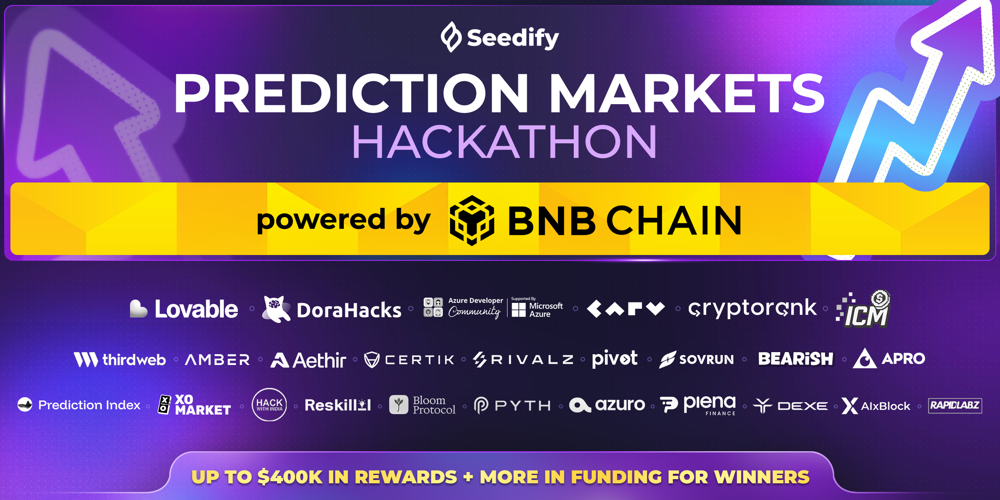

<div align="center"> 
	<a href="https://dorahacks.io" target="_blank">
		 
	</a>
</div>

<div align="center"> 
	
</div>

# Seer

**Seer** is a decentralized prediction platform on BNB Chain that uses AI to create markets from news and resolve them faster than traditional oracles. Unlike UMA's 24-48h optimistic oracle, our AI-assisted resolution provides near-instant results while maintaining accuracy through evidence-based analysis. The platform automatically generates tradeable markets from current events, allows users to bet on outcomes, and uses AI to suggest resolutions based on verifiable facts. All bets and payouts are settled on-chain with a 2% platform fee. The modern web interface makes prediction markets accessible to non-technical users, addressing the UX gap in current DeFi prediction markets. Revenue is generated through platform fees, creating a sustainable business model.

**Features:**
- **BNB Chain**: Mainnet and testnet support for all transactions
- **AI Market Generation**: Automatically generates tradeable markets from news articles
- **AI-Powered Resolution**: Resolves markets in minutes instead of days using OpenAI
- **On-Chain Settlement**: All bets and payouts settled on BNB Chain smart contracts
- **MetaMask Integration**: Seamless wallet connection for market creation and betting
- **Real-Time Updates**: Live market data and pool sizes
- **Revenue Model**: 2% platform fee on all winning bet payouts
- **Fully On-Chain**: All market data stored on blockchain (no database)
- **Smart Contract Testing**: Comprehensive Hardhat test suite
- **Docker Support**: Full stack deployment with docker-compose

Use cases for Seer include event prediction markets, news-based trading, sports betting, political predictions, crypto price predictions, and any scenario requiring fast, AI-assisted market resolution with on-chain settlement.

<div align="center"> 
	 
	 
	 
	 
	 
	 
	 
	 
</div>

<div align="center"> 
	
	 
	 
	 
	
</div>

<div align="center"> 
	 
	 
	
</div>

## Project Structure

```
seer/
├── nextjs/
│   ├── app/              # Next.js App Router pages
│   ├── components/       # React components
│   ├── public/           # Static assets
│   └── package.json
├── expressjs/
│   ├── server.js         # Express API server
│   ├── ai-service.js    # OpenAI integration
│   ├── blockchain.js    # BNB Chain integration
│   ├── docs/            # Documentation
│   └── package.json
└── bnb/
    ├── contracts/       # Solidity contracts
    ├── scripts/         # Deployment scripts
    ├── test/           # Contract tests
    └── package.json
```

## Project Overview

**Seer** is a decentralized prediction market platform that leverages AI intelligence with blockchain technology to create, manage, and resolve prediction markets faster than traditional oracle-based systems.

## Hackathon Alignment

This project addresses several YZi Labs Preferred Project opportunities:

1. **AI-Assisted Oracles**: Faster resolution than UMA's 24-48h optimistic oracle
2. **Subjective Predictions**: AI can resolve subjective or multi-stage predictions
3. **Better UX**: Modern web interface makes prediction markets feel like normal apps
4. **Revenue Focus**: Platform fees create sustainable business model

## Quick Start

### Prerequisites

- Node.js 16+ and npm
- MetaMask browser extension
- BNB Chain testnet BNB (for testing)
- OpenAI API key (for AI features)

### Installation

**1. Clone the repository:**
```bash
git clone https://github.com/kd-s-t/seer.git
cd seer
```

**2. Install dependencies for each service:**

```bash
# Backend
cd expressjs && npm install && cd ..

# Frontend
cd nextjs && npm install && cd ..

# Smart Contracts
cd bnb && npm install && cd ..
```

**3. Set up and start services:**

- **Backend**: See [expressjs/README.md](expressjs/README.md) for detailed setup instructions
- **Frontend**: See [nextjs/README.md](nextjs/README.md) for detailed setup instructions
- **Smart Contracts**: See [bnb/README.md](bnb/README.md) for deployment instructions

**Quick start:**
1. Deploy smart contract (see `bnb/README.md`)
2. Configure backend environment variables (see `expressjs/README.md`)
3. Start backend: `cd expressjs && npm run dev`
4. Configure frontend environment variables (see `nextjs/README.md`)
5. Start frontend: `cd nextjs && npm run dev`

## Usage

### Creating Markets

1. **Manual Creation:**
   - Connect your MetaMask wallet
   - Enter a question (e.g., "Will Bitcoin reach $100k by end of 2024?")
   - Add outcomes (comma-separated, e.g., "Yes, No")
   - Set duration (1-168 hours)
   - Click "Create Market"

2. **AI-Generated Markets:**
   - Click "🤖 Generate with AI" button
   - AI will suggest markets based on current news
   - Review and create the suggested market

### Placing Bets

1. Browse active markets
2. Select an outcome
3. Enter bet amount (minimum 0.001 BNB)
4. Click "Bet"
5. Confirm transaction in MetaMask

### Resolving Markets

Markets can be resolved:
- **Manually**: By the market creator after the end time
- **AI-Assisted**: Use AI to suggest the winning outcome
- **Automatically**: After end time (if configured)

## API Endpoints

See [expressjs/README.md](expressjs/README.md) for complete API documentation.

## Testing

### Smart Contract Tests (Hardhat)

```bash
cd bnb
npm test
npm run test:coverage  # With coverage report
npm run node           # Start local Hardhat node
```

**Contract tests cover:**
- ✅ Market creation and validation
- ✅ Betting functionality
- ✅ Market resolution
- ✅ Winner payouts and platform fees
- ✅ Edge cases and security

### Backend Tests

```bash
cd expressjs
npm test
```

## Technical Stack

- **Frontend**: Next.js 15, React 19, TypeScript, Material-UI v5, Framer Motion, ethers.js, MetaMask
- **Backend**: Node.js, Express.js, OpenAI API
- **Blockchain**: Solidity 0.8.20, Hardhat, ethers.js
- **AI**: OpenAI GPT-3.5/GPT-4
- **Storage**: Fully on-chain (BNB Chain smart contracts)
- **Wallet**: MetaMask integration

## Docker

Run the entire stack with Docker:

```bash
docker-compose up
```

This starts both frontend and backend services.

## Revenue Model

- **Platform Fee**: 2% of all winning bet payouts
- **Market Creation**: Free (can add fees in future)
- **AI Features**: Powered by OpenAI API (costs covered by platform fees)

## Submission Requirements

### ✅ Completed

- [x] **Public Code Repo**: All code is in this repository
- [x] **Working Prototype**: 
  - [x] User interaction (React web interface with wallet connection)
  - [x] AI integration (market generation and resolution)
  - [x] Blockchain integration (BNB Chain smart contracts - fully on-chain)
- [x] **Tests**: Basic test suite included
- [x] **BNB Chain**: All contracts deployable to BNB Chain

### Team Info (150 words)

[Add your team information here]

## Future Enhancements

- [ ] Account abstraction for gasless transactions
- [ ] Mobile app
- [ ] Advanced AI models for better predictions
- [ ] Liquidity pools for market making
- [ ] Social features (following traders, market discussions)
- [ ] Multi-chain support
- [ ] NFT rewards for top traders

**Built for Seedify Predictions Market Hackathon**

---

## Authors

- [@kenn](https://www.linkedin.com/in/kdst/)
- [@don](https://www.linkedin.com/in/carl-john-don-sebial-882430187/)
- [@peter](https://www.linkedin.com/in/petertibon/)
